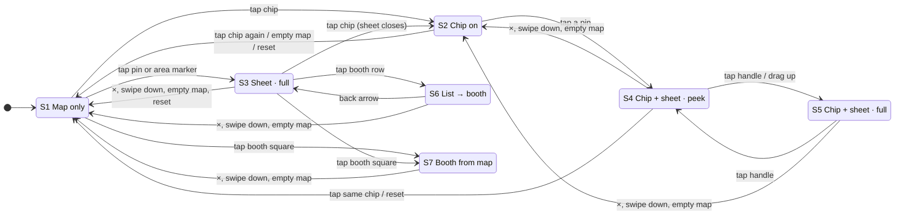

# Interaction states

How the map behaves, **as built after round 2 of the 10/6 interaction PR**. Every state, every action and what each does. Cells marked **OPEN** are places that are still undefined or inconsistent; round 1's six were decided by Ernest and are built (section 7).

The same content is in `design-system.html`, section 6, with the diagram drawn there.

## 1 · States

The zoom stop (below) is a second, independent dimension: any state can be at any of the three stops.

| | State | What it is |
|---|---|---|
| S1 | **Map only** | No chip, no sheet. |
| S2 | **Chip on** | A filter chip is on, no sheet. The chip's pins are bright and on top; everything else is dimmed and takes no taps. |
| S3 | **Sheet open · full** | No chip. A pin card, a stage lineup (the schedule), the Food Court, or an art-market area's booth list, at full height. |
| S4 | **Chip on + sheet · peek** | A sheet opened while a chip is on opens at peek height (`--sheet-peek-height`) so the map stays visible. The ItemPager is not shown. |
| S5 | **Chip on + sheet · full** | The same sheet after the handle was tapped or dragged up. |
| S6 | **List → booth (inside the sheet)** | A booth opened from a row in an area's list: ONE sheet, the content slid to the booth, a back row (`‹ <area>`) above the title, the ItemPager in the footer. The chip is off (an area list clears it). |
| S7 | **Booth opened from the map** | A booth opened by tapping its square: the same booth sheet with no list behind it, so no back row. |

The docked panel (desktop, 1024px and up) has no peek, no handle and no ×: the directory is its resting state, a detail replaces it, and `‹ All locations` (or `‹ <area>` for a booth opened from a list) goes back. Esc does nothing there. Every other rule below applies the same way.

### The three zoom stops

| Stop | What the map draws |
|---|---|
| **1 · Overview** | Area blobs, no individual booths. Pins flagged `overview` (stages, Food Court, Kidlandia, first aid, bike valet, beer, merch, the art-market markers) plus any chip's pins. The whole festival is in frame. |
| **2 · Booths** | Blobs give way to the individual squares (no numbers). Amenity pins appear, except those held back with `from: 'detail'`. Art-market markers still show. |
| **3 · Detail** | Booth numbers and area names are drawn; the art-market markers have faded out so every booth is its own target; `from: 'detail'` pins appear; the Food Court pin gives way to its stalls. |

Changed by: the zoom buttons, double-tap on empty map (steps in; at Detail goes back to the overview), a pinch (follows the fingers, settles on the nearest stop), a chip going on (to the overview), reset, and a pin tap that needs a closer stop to reach the safe area.

## 2 · Actions

1. Tap a live pin, 2. Tap a dimmed pin, 3. Tap a chip, 4. Tap empty map, 5. Close × / Esc, 6. Swipe the sheet down, 7. Drag the handle up / tap the handle, 8. Pinch zoom, 9. Pan, 10. ItemPager ‹ ›, 11. Back arrow (‹ list), 12. Tap a booth row in a list, 13. Tap an art-market marker, 14. Tap a booth square on the map, 15. Zoom buttons / double-tap, 16. Reset (arrows-to-corners), 17. Browser / Android back, 18. Rotate the phone.

## 3 · Transition table

One table per state: what each action does, and the state it leaves you in (**→ Sn**). `—` means the action does not exist in that state. **OPEN** marks a cell that is undefined or inconsistent today.

### S1 · Map only

| Action | What happens |
|---|---|
| Tap a live pin | Opens the pin's card at full height; the pin wears the navy ring; the map pans so the pin sits centred in the safe area, zooming in only if it has to. → **S3** |
| Tap a dimmed pin | There are no dimmed pins with no chip on. |
| Tap a chip | Chip on, map goes to the overview so the whole category is in frame. → **S2** |
| Tap empty map | Nothing. (A double-tap zooms in a stop.) |
| Pinch zoom | Follows the fingers, settles on the nearest of the three stops. |
| Pan | Pans, inside the pan limits (festival + the header and chip row). |
| Tap an art-market marker | Opens the area's booth list at full height. → **S3** |
| Tap a booth square on the map | Opens that booth's sheet (no list behind it) and pans through the safe-area pan, like a pin. → **S7** |
| Zoom buttons / double-tap | Changes the stop. No layer changes. |
| Reset (arrows-to-corners) | Already clean: goes to the overview. |
| Browser / Android back | Leaves the map for the page before. Nothing is on screen to close, so no history entry was pushed. |
| Rotate the phone | The map refits at the same stop and centre. |

### S2 · Chip on

| Action | What happens |
|---|---|
| Tap a live pin | Opens the pin's card at PEEK height; ring; the pin pans into the safe area above the sheet. The chip stays on: a pin tap never touches it. → **S4** |
| Tap a dimmed pin | A dimmed pin has pointer-events: none, so the tap falls through to the map and counts as a tap on empty map: the chip turns off. → **S1** |
| Tap a chip | Same chip: off, the map stays where it is. Another chip: switches, back to the overview. → **S1 / S2** |
| Tap empty map | The chip turns off. The map stays. → **S1** |
| Pinch zoom | As S1. The chip's pins show at every stop. |
| Pan | As S1. |
| Tap an art-market marker | Art-market markers are dimmed, so this is a tap on empty map: the chip turns off. → **S1** |
| Tap a booth square on the map | Every booth square is dimmed (art, food stalls, Kidlandia, the unnumbered two): none is in a chip's category. A tap falls through like a tap on a dimmed pin: it opens nothing, and no booth handler touches the chip. → **S1** |
| Zoom buttons / double-tap | As S1. |
| Reset (arrows-to-corners) | The chip turns off and the map goes to the overview. → **S1** |
| Browser / Android back | Back clears the chip (one history entry per layer). → **S1** |
| Rotate the phone | As S1. |

### S3 · Sheet open · full

| Action | What happens |
|---|---|
| Tap a live pin | The sheet swaps to the new card (drops, then rises); the ring moves; the pin pans into the safe area. Stays full. → **S3** |
| Tap a dimmed pin | There are no dimmed pins with no chip on. |
| Tap a chip | The sheet closes, the chip comes on, the map goes to the overview. → **S2** |
| Tap empty map | The sheet closes. The map stays. → **S1** |
| Close × / Esc | Closes the sheet. → **S1** |
| Swipe the sheet down | Closes if dragged past 30% of the sheet's height, or flicked (over 0.5 px/ms and over 40px). Let go short of that and it springs back. → **S1** |
| Drag the handle up / tap the handle | Nothing: with no chip on there is no peek, so no second detent. The handle still drags down. (On a phone on its side the sheet is capped at peek and the handle does not expand it.) |
| Pinch zoom | The map zooms under the sheet; the sheet stays. When the pinch settles the selected pin is re-centred in the safe area: the same routine as a tap, at the stop the visitor is at, stepping in only if the pan alone cannot reach. |
| Pan | Pans in the visible band above the sheet. The sheet stays. |
| Tap a booth row in a list | On an area list: the booth PUSHES in from the right inside the same sheet; the map pans to it. → **S6** |
| Tap an art-market marker | Swaps in that area's list (or the same list, if it is already open). → **S3** |
| Tap a booth square on the map | On an area list, a square in the SAME area pushes that booth with the list kept under it (the back row stays); a square in another area, or any square while a pin card is open, swaps the sheet to the booth with no list. The map pans through the safe-area pan. → **S6 / S7** |
| Zoom buttons / double-tap | As S1. The sheet stays. |
| Reset (arrows-to-corners) | Closes the sheet, chip off, overview. → **S1** |
| Browser / Android back | Back closes the sheet. → **S1** |
| Rotate the phone | The sheet stays open. On a phone in landscape (max-height 500px) it is capped at peek height (208px) and cannot expand; the map refits and the selected pin is re-centred in the safe area. |

### S4 · Chip on + sheet · peek

| Action | What happens |
|---|---|
| Tap a live pin | The sheet swaps to the new card, stays at peek; the ring moves; the pin pans into the safe area above the peek sheet. → **S4** |
| Tap a dimmed pin | Falls through to the map: a tap on empty map. With a sheet open that closes the sheet and leaves the chip on. → **S2** |
| Tap a chip | Same chip: sheet closes, chip off. Another chip: sheet closes, switches, overview. → **S1 / S2** |
| Tap empty map | The sheet closes. The chip stays on, all its pins stay, the map stays. → **S2** |
| Close × / Esc | Closes the sheet. The chip stays on. → **S2** |
| Swipe the sheet down | As S3 (30% or a flick closes; shorter springs back). The chip stays on. → **S2** |
| Drag the handle up / tap the handle | Tap the handle, or pull it up 30px: full height. The map re-centres the pin in the new safe area (it can take one zoom stop in if it must). → **S5** |
| Pinch zoom | As S3: the selected pin is re-centred once the pinch settles. |
| Pan | As S3. |
| Tap an art-market marker | Art-market markers are dimmed: a tap on empty map (closes the sheet). → **S2** |
| Tap a booth square on the map | Every booth square is dimmed: a tap falls through, which closes the sheet and leaves the chip on. → **S2** |
| Zoom buttons / double-tap | As S1. |
| Reset (arrows-to-corners) | Closes the sheet, chip off, overview. → **S1** |
| Browser / Android back | Back closes the sheet; the chip stays. → **S2** |
| Rotate the phone | As S3: peek is also the landscape cap. |

### S5 · Chip on + sheet · full

| Action | What happens |
|---|---|
| Tap a live pin | Swaps to the new card; the sheet stays FULL (the detent persists across swaps within one open). → **S5** |
| Tap a dimmed pin | As S4: falls through; closes the sheet, chip stays. → **S2** |
| Tap a chip | As S4. → **S1 / S2** |
| Tap empty map | As S4. → **S2** |
| Close × / Esc | As S4. → **S2** |
| Swipe the sheet down | The first swipe steps down to PEEK; a second swipe closes (one layer at a time, like a tap on empty map). → **S4** |
| Drag the handle up / tap the handle | Tap the handle: back to peek. Drag up: nothing (already full). → **S4** |
| Pinch zoom | As S3. |
| Pan | As S3. |
| Tap an art-market marker | As S4. → **S2** |
| Tap a booth square on the map | As S4. → **S2** |
| Zoom buttons / double-tap | As S1. |
| Reset (arrows-to-corners) | As S4. → **S1** |
| Browser / Android back | Back closes the sheet; the chip stays. → **S2** |
| Rotate the phone | Rotating to landscape caps the sheet at peek. → **S4** |

### S6 · List → booth (inside the sheet)

| Action | What happens |
|---|---|
| Tap a live pin | The sheet swaps to the pin's card. The list context is dropped: no back row. → **S3** |
| Tap a dimmed pin | There are no dimmed pins with no chip on. |
| Tap a chip | The sheet closes, the chip comes on. → **S2** |
| Tap empty map | The sheet closes (all the way, not back to the list). The map stays. → **S1** |
| Close × / Esc | Closes the sheet, all the way. Does not step back to the list. → **S1** |
| Swipe the sheet down | Closes the sheet, all the way. → **S1** |
| Drag the handle up / tap the handle | Nothing (no peek). |
| Pinch zoom | As S3: the selected booth is re-centred once the pinch settles. |
| Pan | Pans. The booth stays selected (navy square). |
| ItemPager ‹ › | Pages to the previous / next booth in this area (wraps inside it). The content changes in place; the ItemPager does not move; the map holds still while the booth is inside the safe area and centres it once if not. The back row is unchanged: paging never adds a back step. → **S6** |
| Back arrow (‹ list) | POPS: the booth slides out to the right and the list returns at the scroll position you left it; the sheet's height does not change; the booth is deselected. → **S3** |
| Tap an art-market marker | Swaps in that area's list. → **S3** |
| Tap a booth square on the map | A square in the SAME area: the booth swaps in place, the list stays under it, the back row stays. A square in another area (or a food stall): the list is dropped, no back row. The map pans through the safe-area pan. → **S6 / S7** |
| Zoom buttons / double-tap | As S1. |
| Reset (arrows-to-corners) | Closes the sheet, chip off, overview. → **S1** |
| Browser / Android back | Back closes the sheet (not back to the list: one layer per entry). → **S1** |
| Rotate the phone | **OPEN:** As S3: capped at peek in landscape. The ItemPager is not shown at peek, so on a phone on its side booths cannot be paged. |

### S7 · Booth opened from the map

| Action | What happens |
|---|---|
| Tap a live pin | The sheet swaps to the pin's card. → **S3** |
| Tap a dimmed pin | There are no dimmed pins with no chip on. |
| Tap a chip | The sheet closes, the chip comes on. → **S2** |
| Tap empty map | The sheet closes. → **S1** |
| Close × / Esc | Closes the sheet. → **S1** |
| Swipe the sheet down | Closes the sheet. → **S1** |
| Drag the handle up / tap the handle | Nothing (no peek). |
| Pinch zoom | As S3. |
| Pan | Pans. |
| ItemPager ‹ › | As S6: pages within the area, in place, ItemPager fixed. |
| Tap an art-market marker | Swaps in that area's list. → **S3** |
| Tap a booth square on the map | The booth swaps in place (no list to keep); the map pans through the safe-area pan. → **S7** |
| Zoom buttons / double-tap | As S1. |
| Reset (arrows-to-corners) | Closes the sheet, overview. → **S1** |
| Browser / Android back | Back closes the sheet. → **S1** |
| Rotate the phone | **OPEN:** As S6: capped at peek in landscape, and the ItemPager is hidden there. |

## 4 · State diagram

## 5 · The agreed rules

1. **Chip on → its pins stay bright and everything else dims.** Dimmed pins and every booth square take no taps.
2. **Closing the sheet keeps the chip on.** × , swipe down and Esc close the sheet only.
3. **A tap on empty map clears one layer at a time:** first the sheet, then the chip. So does the back button.
4. **Tapping the chip again turns it off.** The map stays where it is.
5. **Close is always top-right, on the first row under the handle.** In every sheet state; it never moves when the content does.
6. **The way you step in is the way you step out.** A booth opened from a list pushes in from the right and ‹ back pops it to the right; the sheet's height is held; paging with the ItemPager never adds a step.
7. **A control you tap repeatedly never moves.** The ItemPager is pinned to the bottom of the sheet, above the home bar.
8. **No tap target overlaps another,** at any zoom stop, on either map, or on paper. Pins have a 44px hit area (`--pin-hit`), controls are at least `--tap-min`.
9. **Times are always readable on one line.** A set time is a fixed-width column that never wraps; the artist wraps instead.
10. **A pan or a pinch is never a tap.** Only a genuine tap clears a layer.
11. **Every pan that targets a pin or a booth centres it in the map safe area,** and runs again after a pinch settles and after a resize.
12. **Swipe down from a full chip sheet stops at peek;** the second swipe closes. On a phone on its side the sheet is capped at peek.

## 6 · Tested explicitly (10/6)

Run against the build of this PR on a 390×844 touch viewport (Playwright, real two-finger touch for the pinch). Behaviour was not changed for any of these; each is recorded in the tables above.

| Case | Result |
|---|---|
| Tap a dimmed pin while a chip is on | The pin has pointer-events: none, so the tap reaches the map. No sheet open: the chip turns off (390×844, Restrooms on, tapped the Main Stage pin). Sheet open: the sheet closes and the chip stays on. Every booth square now behaves the same way (round 2): e2e taps one for real with and without a sheet. |
| Pinch-zoom while the sheet is open | The map zooms and settles on the nearest stop and the sheet stays open. When it settles the selected booth is re-centred above the sheet (390×844, pinched from Detail to the Booths stop with a booth sheet open; that stop has no vertical pan on a tall phone, so it stepped in one stop to reach). Round 1 left the booth under the sheet. |
| Android / browser back, sheet open or chip on | One history entry per layer. Back with a sheet open closes the sheet and stays on the map; with a chip and a sheet it closes the sheet, then clears the chip; with nothing open it leaves. A layer closed by × or a tap takes its entry with it (no stale entry), and open / close / open in quick succession still closes the new sheet on back. |
| Rotate the phone with the sheet open | 390×844 → 844×390 with a booth sheet open: the sheet is capped at 184px (peek is 208px), the map refits and the booth ends at y 154–172 with the header ending at 120 and the sheet starting at 206. In round 1 the sheet was 281px and the booth ended 68px above the screen. |
| Swipe the sheet down partway, then let go | Dragging the handle (or the header) slowly: 15% and 25% of the sheet's height spring back; 35% and 50% close it. The threshold is 30%, or a flick faster than 0.5 px/ms that travels at least 40px. From a full sheet with a chip on, the first swipe steps down to peek and the second closes. |

## 7 · Decisions (Ernest, 10/6) and what is still OPEN

Round 1 left six cells OPEN. Ernest decided all six on 10/6; each is built and has an e2e test.

| Was OPEN | Decided | Item |
|---|---|---|
| Browser / Android back | Closes the sheet first, then clears the chip, then leaves the page: one history entry per layer. | 4.1 · `useLayerHistory` |
| Pinch or rotate with a sheet open | The safe-area pan re-runs after a pinch settles and after a resize. On a phone in landscape the sheet opens at and is capped at peek height. | 4.2 |
| Booth squares with a chip on | Every booth square is dimmed (food, Kidlandia, unnumbered included). A tap behaves like a tap on a dimmed pin; no booth handler clears the chip. | 4.3 |
| Booth square tap on the map | Pans through the same safe-area pan as a pin. | 4.4 |
| Booth square tapped while a booth-from-list is open | Same area: the list stays under it and the back row stays. Different area: the list is dropped. | 4.5 · `boothInArea` |
| Swipe down from a full sheet with a chip on | The first swipe stops at peek, the second closes. | 4.6 |

**Still OPEN:**

- **The ItemPager on a phone on its side.** Landscape caps the sheet at peek height and the ItemPager is not shown at peek, so booths cannot be paged in landscape. Show the ItemPager at peek in landscape only, or leave paging to portrait? (S6, S7)
