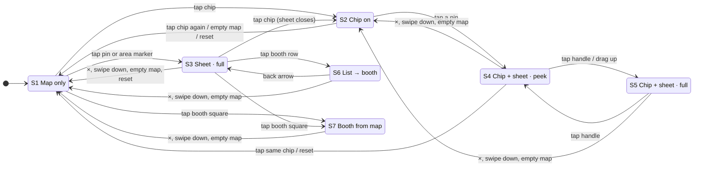

# Interaction states

How the map behaves, **as built after the 10/6 interaction PR**. Written so Ernest can see every state, every action and what each does, and answer the cells marked **OPEN**: places that are undefined or inconsistent today. Nothing marked OPEN has been changed; each is a decision.

The same content is in `design-system.html`, section 6, with the diagram drawn there.

## 1 · States

The zoom stop (below) is a second, independent dimension: any state can be at any of the three stops.

| | State | What it is |
|---|---|---|
| S1 | **Map only** | No chip, no sheet. |
| S2 | **Chip on** | A filter chip is on, no sheet. The chip's pins are bright and on top; everything else is dimmed and takes no taps. |
| S3 | **Sheet open · full** | No chip. A pin card, a stage lineup (the schedule), the Food Court, or an art-market area's booth list, at full height. |
| S4 | **Chip on + sheet · peek** | A sheet opened while a chip is on opens at peek height (`--sheet-peek-height`) so the map stays visible. The ItemPager is not shown. |
| S5 | **Chip on + sheet · full** | The same sheet after the handle was tapped or dragged up. |
| S6 | **List → booth (inside the sheet)** | A booth opened from a row in an area's list: ONE sheet, the content slid to the booth, a back row (`‹ <area>`) above the title, the ItemPager in the footer. The chip is off (an area list clears it). |
| S7 | **Booth opened from the map** | A booth opened by tapping its square: the same booth sheet with no list behind it, so no back row. |

The docked panel (desktop, 1024px and up) has no peek, no handle and no ×: the directory is its resting state, a detail replaces it, and `‹ All locations` (or `‹ <area>` for a booth opened from a list) goes back. Esc does nothing there. Every other rule below applies the same way.

### The three zoom stops

| Stop | What the map draws |
|---|---|
| **1 · Overview** | Area blobs, no individual booths. Pins flagged `overview` (stages, Food Court, Kidlandia, first aid, bike valet, beer, merch, the art-market markers) plus any chip's pins. The whole festival is in frame. |
| **2 · Booths** | Blobs give way to the individual squares (no numbers). Amenity pins appear, except those held back with `from: 'detail'`. Art-market markers still show. |
| **3 · Detail** | Booth numbers and area names are drawn; the art-market markers have faded out so every booth is its own target; `from: 'detail'` pins appear; the Food Court pin gives way to its stalls. |

Changed by: the zoom buttons, double-tap on empty map (steps in; at Detail goes back to the overview), a pinch (follows the fingers, settles on the nearest stop), a chip going on (to the overview), reset, and a pin tap that needs a closer stop to reach the safe area.

## 2 · Actions

1. Tap a live pin, 2. Tap a dimmed pin, 3. Tap a chip, 4. Tap empty map, 5. Close × / Esc, 6. Swipe the sheet down, 7. Drag the handle up / tap the handle, 8. Pinch zoom, 9. Pan, 10. ItemPager ‹ ›, 11. Back arrow (‹ list), 12. Tap a booth row in a list, 13. Tap an art-market marker, 14. Tap a booth square on the map, 15. Zoom buttons / double-tap, 16. Reset (arrows-to-corners), 17. Browser / Android back, 18. Rotate the phone.

## 3 · Transition table

One table per state: what each action does, and the state it leaves you in (**→ Sn**). `—` means the action does not exist in that state. **OPEN** marks a cell that is undefined or inconsistent today.

### S1 · Map only

| Action | What happens |
|---|---|
| Tap a live pin | Opens the pin's card at full height; the pin wears the navy ring; the map pans so the pin sits centred in the safe area, zooming in only if it has to. → **S3** |
| Tap a dimmed pin | There are no dimmed pins with no chip on. |
| Tap a chip | Chip on, map goes to the overview so the whole category is in frame. → **S2** |
| Tap empty map | Nothing. (A double-tap zooms in a stop.) |
| Pinch zoom | Follows the fingers, settles on the nearest of the three stops. |
| Pan | Pans, inside the pan limits (festival + the header and chip row). |
| Tap an art-market marker | Opens the area's booth list at full height. → **S3** |
| Tap a booth square on the map | **OPEN:** Opens that booth's sheet (no list behind it). The map does NOT pan to it, so with the sheet open the booth can be behind the sheet; a pin tap does pan. → **S7** |
| Zoom buttons / double-tap | Changes the stop. No layer changes. |
| Reset (arrows-to-corners) | Already clean: goes to the overview. |
| Browser / Android back | **OPEN:** Leaves the map for whatever page came before. No history entry exists for the map's own states. |
| Rotate the phone | The map refits at the same stop and centre. |

### S2 · Chip on

| Action | What happens |
|---|---|
| Tap a live pin | Opens the pin's card at PEEK height; ring; the pin pans into the safe area above the sheet. The chip stays on: a pin tap never touches it. → **S4** |
| Tap a dimmed pin | A dimmed pin has pointer-events: none, so the tap falls through to the map and counts as a tap on empty map: the chip turns off. (Tested 10/6.) → **S1** |
| Tap a chip | Same chip: off, the map stays where it is. Another chip: switches, back to the overview. → **S1 / S2** |
| Tap empty map | The chip turns off. The map stays. → **S1** |
| Pinch zoom | As S1. The chip's pins show at every stop. |
| Pan | As S1. |
| Tap an art-market marker | Art-market markers are dimmed, so this is a tap on empty map: the chip turns off. → **S1** |
| Tap a booth square on the map | **OPEN:** Art squares are dimmed (tap on empty map: chip off). Food stalls, Kidlandia and the two unnumbered squares are NOT dimmed: tapping one opens its booth AND clears the chip, which a pin tap never does. → **S7** |
| Zoom buttons / double-tap | As S1. |
| Reset (arrows-to-corners) | The chip turns off and the map goes to the overview. → **S1** |
| Browser / Android back | **OPEN:** Leaves the map. Same gap as S1. |
| Rotate the phone | As S1. |

### S3 · Sheet open · full

| Action | What happens |
|---|---|
| Tap a live pin | The sheet swaps to the new card (drops, then rises); the ring moves; the pin pans into the safe area. Stays full. → **S3** |
| Tap a dimmed pin | There are no dimmed pins with no chip on. |
| Tap a chip | The sheet closes, the chip comes on, the map goes to the overview. → **S2** |
| Tap empty map | The sheet closes. The map stays. → **S1** |
| Close × / Esc | Closes the sheet. → **S1** |
| Swipe the sheet down | Closes if dragged past 30% of the sheet's height, or flicked (over 0.5 px/ms and over 40px). Let go short of that and it springs back. (Tested 10/6: 25% springs back, 35% closes.) → **S1** |
| Drag the handle up / tap the handle | Nothing: with no chip on there is no peek, so no second detent. The handle still drags down. |
| Pinch zoom | **OPEN:** The map zooms under the sheet; the sheet stays. The selected pin is not re-centred, so it can end up under the sheet. (Tested 10/6.) |
| Pan | Pans in the visible band above the sheet. The sheet stays. |
| Tap a booth row in a list | On an area list: the booth slides in inside the same sheet; the map pans to it. → **S6** |
| Tap an art-market marker | Swaps in that area's list (or the same list, if it is already open). Clears any chip. → **S3** |
| Tap a booth square on the map | **OPEN:** The sheet swaps to that booth (drops and rises); no list behind it. The map does not pan to it. → **S7** |
| Zoom buttons / double-tap | As S1. The sheet stays. |
| Reset (arrows-to-corners) | Closes the sheet, chip off, overview. → **S1** |
| Browser / Android back | **OPEN:** Leaves the map; the sheet is not a history state. |
| Rotate the phone | **OPEN:** The sheet stays open. On a phone in landscape the sheet (72% of the height) plus the header leave no visible map, and the selected pin is not re-centred (it ended 68px above the screen in the 10/6 test). |

### S4 · Chip on + sheet · peek

| Action | What happens |
|---|---|
| Tap a live pin | The sheet swaps to the new card, stays at peek; the ring moves; the pin pans into the safe area above the peek sheet. → **S4** |
| Tap a dimmed pin | Falls through to the map: a tap on empty map. With a sheet open that closes the sheet and leaves the chip on. (Tested 10/6.) → **S2** |
| Tap a chip | Same chip: sheet closes, chip off. Another chip: sheet closes, switches, overview. → **S1 / S2** |
| Tap empty map | The sheet closes. The chip stays on, all its pins stay, the map stays. → **S2** |
| Close × / Esc | Closes the sheet. The chip stays on. → **S2** |
| Swipe the sheet down | As S3 (30% or a flick closes; shorter springs back). The chip stays on. → **S2** |
| Drag the handle up / tap the handle | Tap the handle, or pull it up 30px: full height. The map re-centres the pin in the new safe area (it can take one zoom stop in if it must). → **S5** |
| Pinch zoom | **OPEN:** As S3: the selected pin can end under the sheet. |
| Pan | As S3. |
| Tap an art-market marker | Art-market markers are dimmed: a tap on empty map (closes the sheet). |
| Tap a booth square on the map | **OPEN:** Art squares are dimmed (tap on empty map). Food stalls and the other undimmed squares open their booth and clear the chip, as in S2. → **S7** |
| Zoom buttons / double-tap | As S1. |
| Reset (arrows-to-corners) | Closes the sheet, chip off, overview. → **S1** |
| Browser / Android back | **OPEN:** Leaves the map. |
| Rotate the phone | **OPEN:** As S3: the peek sheet is 208px, and in landscape on a 390px-tall phone the header and sheet still crowd the map. |

### S5 · Chip on + sheet · full

| Action | What happens |
|---|---|
| Tap a live pin | Swaps to the new card; the sheet stays FULL (the detent persists across swaps within one open). → **S5** |
| Tap a dimmed pin | As S4: falls through; closes the sheet, chip stays. → **S2** |
| Tap a chip | As S4. → **S1 / S2** |
| Tap empty map | As S4. → **S2** |
| Close × / Esc | As S4. → **S2** |
| Swipe the sheet down | **OPEN:** Closes (it does not step down to peek first). Whether one swipe from full should stop at peek is for Ernest. → **S2** |
| Drag the handle up / tap the handle | Tap the handle: back to peek. Drag up: nothing (already full). → **S4** |
| Pinch zoom | **OPEN:** As S3. |
| Pan | As S3. |
| Tap an art-market marker | As S4. |
| Tap a booth square on the map | **OPEN:** As S4. → **S7** |
| Zoom buttons / double-tap | As S1. |
| Reset (arrows-to-corners) | As S4. → **S1** |
| Browser / Android back | **OPEN:** Leaves the map. |
| Rotate the phone | **OPEN:** As S3. |

### S6 · List → booth (inside the sheet)

| Action | What happens |
|---|---|
| Tap a live pin | The sheet swaps to the pin's card. The list context is dropped: no back row. → **S3** |
| Tap a dimmed pin | There are no dimmed pins with no chip on. |
| Tap a chip | The sheet closes, the chip comes on. → **S2** |
| Tap empty map | The sheet closes (all the way, not back to the list). The map stays. → **S1** |
| Close × / Esc | Closes the sheet, all the way. Does not step back to the list. → **S1** |
| Swipe the sheet down | Closes the sheet, all the way. → **S1** |
| Drag the handle up / tap the handle | Nothing (no peek). |
| Pinch zoom | **OPEN:** As S3: the selected booth can end under the sheet. |
| Pan | Pans. The booth stays selected (navy square). |
| ItemPager ‹ › | Pages to the previous / next booth in this area (wraps inside it). The content changes in place; the pager does not move; the map holds still while the booth is inside the safe area and centres it once if not. The back row is unchanged: paging never adds a back step. → **S6** |
| Back arrow (‹ list) | The list slides back in (from the left) at the scroll position you left it; the map stays; the booth is deselected. → **S3** |
| Tap an art-market marker | Swaps in that area's list. → **S3** |
| Tap a booth square on the map | **OPEN:** The booth swaps in place and the back row disappears, because the list is dropped. You stepped in through the list but the sheet no longer offers a way back to it. → **S7** |
| Zoom buttons / double-tap | As S1. |
| Reset (arrows-to-corners) | Closes the sheet, chip off, overview. → **S1** |
| Browser / Android back | **OPEN:** Leaves the map. |
| Rotate the phone | **OPEN:** As S3. |

### S7 · Booth opened from the map

| Action | What happens |
|---|---|
| Tap a live pin | The sheet swaps to the pin's card. → **S3** |
| Tap a dimmed pin | There are no dimmed pins with no chip on. |
| Tap a chip | The sheet closes, the chip comes on. → **S2** |
| Tap empty map | The sheet closes. → **S1** |
| Close × / Esc | Closes the sheet. → **S1** |
| Swipe the sheet down | Closes the sheet. → **S1** |
| Drag the handle up / tap the handle | Nothing (no peek). |
| Pinch zoom | **OPEN:** As S3. |
| Pan | Pans. |
| ItemPager ‹ › | As S6: pages within the area, in place, pager fixed. |
| Tap an art-market marker | Swaps in that area's list. → **S3** |
| Tap a booth square on the map | The booth swaps in place. → **S7** |
| Zoom buttons / double-tap | As S1. |
| Reset (arrows-to-corners) | Closes the sheet, overview. → **S1** |
| Browser / Android back | **OPEN:** Leaves the map. |
| Rotate the phone | **OPEN:** As S3. |

## 4 · State diagram

## 5 · The agreed rules

1. **Chip on → its pins stay bright and everything else dims.** Dimmed pins take no taps.
2. **Closing the sheet keeps the chip on.** × , swipe down and Esc close the sheet only.
3. **A tap on empty map clears one layer at a time:** first the sheet, then the chip.
4. **Tapping the chip again turns it off.** The map stays where it is.
5. **The way you step in is the way you step out.** A booth opened from a list has a back arrow to that list; paging with the ItemPager never adds a step.
6. **A control you tap repeatedly never moves.** The ItemPager is pinned to the bottom of the sheet, above the home bar.
7. **No tap target overlaps another,** at any zoom stop, on either map, or on paper. Pins have a 44px hit area (`--pin-hit`), controls are at least `--tap-min`.
8. **Times are always readable on one line.** A set time is a fixed-width column that never wraps; the artist wraps instead.
9. **A pan or a pinch is never a tap.** Only a genuine tap clears a layer.
10. **Every pan that targets a pin centres it in the map safe area:** the visible map between the header + chip row and the top of the sheet.

## 6 · Tested explicitly (10/6)

Run against the build of this PR on a 390×844 touch viewport (Playwright, real two-finger touch for the pinch). Behaviour was not changed for any of these; each is recorded in the tables above.

| Case | Result |
|---|---|
| Tap a dimmed pin while a chip is on | Nothing special happens to the pin: it has pointer-events: none, so the tap reaches the map. No sheet open: the chip turns off (390×844, Restrooms on, tapped the Main Stage pin → chip off). Sheet open: the sheet closes and the chip stays on. Consistent with the "one layer at a time" rule; no change made. |
| Pinch-zoom while the sheet is open | The map zooms and settles on the nearest stop (pinched in from Detail to the overview) and the sheet stays open at 608px. The selected pin is not re-centred in the safe area, so after a zoom it can sit under the sheet. Flagged OPEN. |
| Android / browser back, sheet open or chip on | The map pushes no history entries, so back leaves the app: the sheet and the chip are not history states. (history.length was unchanged by opening a sheet; going back left the page.) Flagged OPEN: closing the sheet or clearing the chip on back is a decision, not a bug fix. |
| Rotate the phone with the sheet open | The sheet stays open and the map refits at the same stop. In landscape (844×390) the sheet is 72% of the height (281px) and the header is 120px tall, so the visible map has no height at all and the selected pin ended 68px above the top of the screen: it was not re-centred. Flagged OPEN. |
| Swipe the sheet down partway, then let go | Dragging the handle (or the title row) slowly: 15% and 25% of the sheet's height spring back; 35% and 50% close it. The threshold is 30%, or a flick faster than 0.5 px/ms that travels at least 40px. Matches the existing behaviour; no change. |

## 7 · OPEN: for Ernest

Each distinct question once, with the states it appears in.

- **Browser / Android back** (all). Back leaves the map from every state. Should it close the sheet first, then clear the chip (one layer at a time, like a tap on empty map)? That needs the map to push a history entry per layer.
- **Pinch or rotate with a sheet open** (S3 S4 S5 S6 S7). The selected pin is not re-centred after a zoom or a rotation, so it can end under the sheet; in landscape on a phone the header and a 72% sheet leave no visible map. Re-run the safe-area pan after a pinch settles and after a resize, and cap the sheet's height in landscape?
- **Tapping a booth square with a chip on** (S2 S4 S5). Food stalls, Kidlandia and the unnumbered squares are not dimmed, and tapping one clears the chip, which a pin tap never does. Dim them with the art squares, or leave the chip on?
- **A booth square tapped on the map does not pan** (S1 S3 S7). A pin tap (and a list row, and a pager step) centres the target in the safe area; a tap on a booth square does not, so the booth can be behind the sheet that just opened. Route it through the same safe-area pan?
- **Tapping a booth square on the map while a booth-from-list is open** (S6). The back row disappears because the list is dropped. Keep the list under the booth when the square belongs to the same area?
- **Swipe down from a full sheet with a chip on** (S5). It closes. Should the first swipe stop at peek and the second close?
